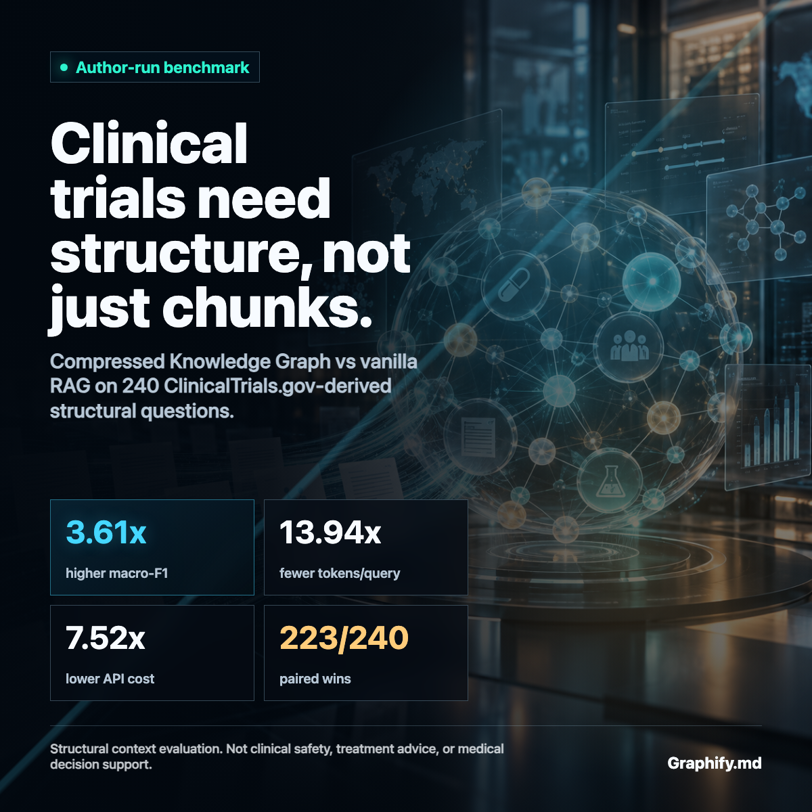

# CKG ClinicalTrials.gov Benchmark

This repository evaluates a Compressed Knowledge Graph (CKG) as an AI context
layer over structural questions derived from ClinicalTrials.gov records. It is a
standalone project by Daniel Yarmoluk. It does not modify, extend, or share
authorship with the separate Yarmoluk-McCreary CKG benchmark paper.

## Corrected Headline Result

Integrity-v2 uses annotation-blind CKG retrieval, equal sampling across all five
query types, structural scoring, all nine taxonomy categories, and a
question-echo control. On 240 matched questions across 12 therapeutic domains:

| System | Structural F1 | Evidence recall | Mean tokens/query | API cost |
| --- | ---: | ---: | ---: | ---: |
| **Annotation-blind CKG** | **1.000000** | **1.000000** | **448.038** | **$0.174297** |
| Configured raw-prose RAG | 0.138716 | 0.290945 | 3,113.800 | $0.805720 |
| Question echo | 0.000000 | 0.000000 | 0 | $0 |

Against the configured vanilla RAG baseline, CKG produced:

- **7.21x the structural F1**
- **6.95x fewer model tokens per query**
- **4.62x lower API cost**
- **210 wins, zero losses, and 30 ties**

The first token-F1 run remains frozen for auditability, but it is superseded as
the primary result because its scorer rewarded question echo and its CKG path
could read answer annotations. Read the [corrected report](INTEGRITY_V2_REPORT.md)
before using any benchmark claim.

## What This Supports

The corrected result shows that annotation-blind traversal recovers the
structure declared in these graphs more accurately and efficiently than this
raw-prose vector-RAG configuration.

It is not evidence that CKG universally replaces RAG or that the generated graph
is clinically correct. Questions and gold answers are graph-generated, and the
RAG corpus does not explicitly encode all graph edges or taxonomy labels.

## Evaluation Surface

- 12 therapeutic domains
- 5,587 ClinicalTrials.gov studies processed
- 2,160 graph nodes and 2,716 declared edges
- 2,064 deterministic benchmark questions
- Five query classes: entity, dependency, path, aggregate, and cross-concept
- Same answer model, structured output prompt, and relation-aware scorer
- 48 questions from each T1-T5 class; all nine taxonomy categories represented
- Question-only CKG retrieval with no IDs, paths, taxonomy tags, or answer keys
- Deterministic question-echo control
- Vanilla RAG: all-MiniLM-L6-v2 embeddings, FAISS, 512-token chunks, 50-token
  overlap, top-5 retrieval

Read the [corrected report](INTEGRITY_V2_REPORT.md), inspect the
[machine-readable integrity-v2 results](results/integrity-v2/), or follow the
[reproduction instructions](REPRODUCE.md).

## Repository Contents

| Path | Contents |
| --- | --- |
| `benchmark/` | Frozen graph CSVs, source provenance, query sets, and domain manifest |
| `corpus/` | Frozen prose representation used by the RAG baseline |
| `sources/` | Frozen normalized source records and provenance disclosure |
| `evaluation/` | Original harnesses plus integrity-v2 runner, scorer, tests, and verifier |
| `results/integrity-v2/` | Corrected raw outputs, aggregate, and run manifest |
| `results/aggregate/` | Superseded first-run summaries retained as an audit trail |
| `results/raw/full-ckg/` | All 2,064 full CKG outputs |
| `results/raw/paired/` | Exact 240-query CKG, RAG, and no-context outputs |
| `REVIEW.md` | Protocol for independent technical review |

## Independence and Review

Daniel Yarmoluk is the sole author of this repository and evaluation. External
reviewers may be acknowledged after they reproduce, critique, or validate the
work. Review does not imply coauthorship or endorsement.

## Appropriate Citation

> Yarmoluk, Daniel. "CKG ClinicalTrials.gov Benchmark: Structural Context
> Evaluation Across 12 Therapeutic Domains." Graphify.md, 2026.

Machine-readable citation metadata is provided in [CITATION.cff](CITATION.cff).

## Important Scope Notice

ClinicalTrials.gov is the source of the public trial records. This project is not
affiliated with or endorsed by ClinicalTrials.gov, the National Library of
Medicine, or the National Institutes of Health. The benchmark does not evaluate
clinical safety, treatment recommendations, or medical decision support.

## Licenses

- Evaluation code: [MIT](LICENSE)
- Derived benchmark graphs, query sets, and results:
  [CC BY 4.0](LICENSES/DATA.md)
- Underlying trial records: source terms and notices remain with
  ClinicalTrials.gov
